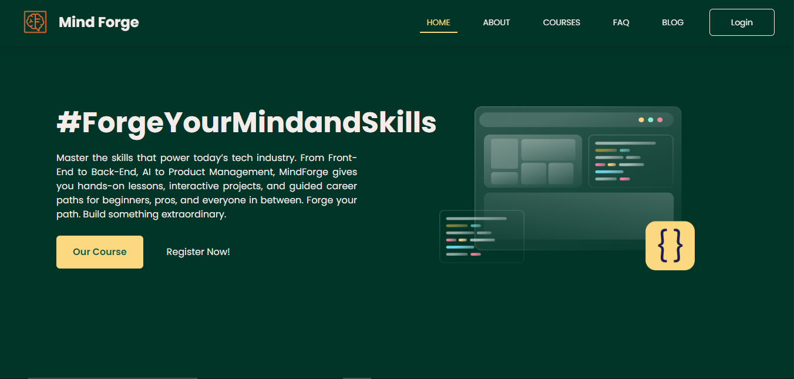

# ⚡ MindForge



<p align="center">
  <a href="https://mind-forge-fe.vercel.app"></a>
  <a href="https://github.com/mind-forgee/mind-forge-fe/blob/main/LICENSE"></a>
</p>

**Live:** [https://mind-forge-fe.vercel.app](https://mind-forge-fe.vercel.app)

---

## 📑 Table of Contents
- [About](#about)
- [Features](#features)
- [Tech Stack](#tech-stack)
- [Project Structure](#project-structure)
- [Environment Variables](#environment-variables)
- [Installation](#installation)
- [Usage](#usage)
- [Contributing](#contributing)
- [License](#license)
- [Acknowledgements](#acknowledgements)

---

## 💡 About

**MindForge** is a modern **web application for learning programming** through interactive, **AI-generated courses**.  
Users can generate and study programming courses tailored to their chosen **topic** and **difficulty**, complete with **practical study cases**.  

MindForge is designed for both **learners** and **administrators**, offering a **seamless and responsive learning experience**.

---

## ✨ Features

### 🔹 General
- **Generate Course from Gemini AI**  
  Create programming courses automatically based on selected topics (e.g., **Frontend Web Development**, **Backend Web Development**, **Mobile Backend Development**) and difficulty levels (**Beginner**, **Intermediate**, **Advanced**).

- **Homepage & Testimonials**  
  Accessible homepage with responsive design and real user testimonials.

### 🔹 User Dashboard
- **Course Learning**  
  Study structured courses with **4–8 chapters**.
- **Study Case**  
  Work on **real-world projects** in the last chapter and practice directly in your IDE.

### 🔹 Admin Dashboard
- **Manage Courses & Topics** (CRUD)
- **View User Statistics**

### 🔹 Authentication
- Secure **Login** and **Registration**

---

## 🛠 Tech Stack

| Layer        | Technologies |
|--------------|--------------|
| **Frontend** | React.js, React Router, React Query, Swiper JS, Axios, Sonner, Tailwind CSS |
| **Backend**  | Express.js (TypeScript), Prisma |
| **Database** | PostgreSQL |
| **Deployment** | Vercel (Frontend), Railway (Backend), Docker (Backend containerization) |

---

## 📂 Project Structure

```bash
frontend/
├── public/
│   └── mindforge-homepage.png
├── src/
│   ├── components/
│   │   ├── chapter/
│   │   ├── courses/
│   │   └── ui/
│   ├── hooks/
│   ├── pages/
│   │   └── users/
│   ├── utils/
│   ├── App.jsx
│   ├── main.jsx
│   └── index.css
├── .env
├── package.json
└── README.md

```

## ⚙️ Environment Variables

Create a .env file inside the frontend directory:

VITE_API_URL=https://api.mindforge.dev


For local development:

VITE_API_URL=http://localhost:3001

---

## 🚀 Installation

Clone the repository

git clone https://github.com/mind-forgee/mind-forge-fe.git
cd mind-forge-fe


Install dependencies

npm install


Setup environment variables

Create a .env file in the project root

Add the required variables (see Environment Variables)

Run the development server

npm run dev


Open in browser

http://localhost:5173

---

## ▶️ Usage

Register or log in to your account.

Generate a course by selecting a topic and difficulty.

Study the chapters and complete the final study case.

Admins can access the dashboard to manage users, courses, and topics.

---

## 🤝 Contributing

Contributions are always welcome! 🚀

Fork the repository

Create a feature branch

git checkout -b feature/your-feature


Commit your changes

git commit -m "Add some feature"


Push to your branch

git push origin feature/your-feature


Open a Pull Request

---

## 📄 License

This project is licensed under the MIT License.
See the LICENSE
 file for more details.

 ---

## 🌟 Acknowledgements

Gemini AI
 for powering course generation

Prisma & PostgreSQL
 for database layer

Vercel & Railway
 for seamless deployment

Open-source community ❤️
